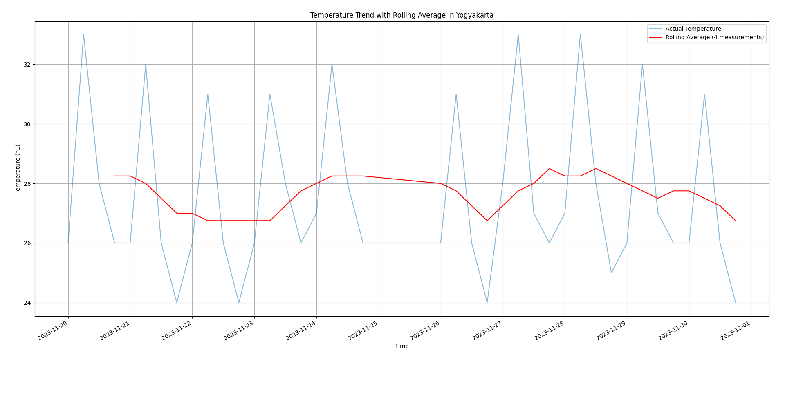

# Weather-Related-Data-Forecasting 🌤️

Made as an assignment for Industrial Management Class.

## Author
**Ahmad Zaki Akmal** - 21/480179/TK/52981

## Credits
- All data owned by [Badan Meterologi, Klimatologi, dan Geofisika (BMKG)](https://bmkg.go.id).
- API by [ibnux](https://github.com/ibnux)
- [API scraper](https://github.com/ahmadzaki2975/ETL-Pipeline) by me.

# Quantitative Time Series Method

